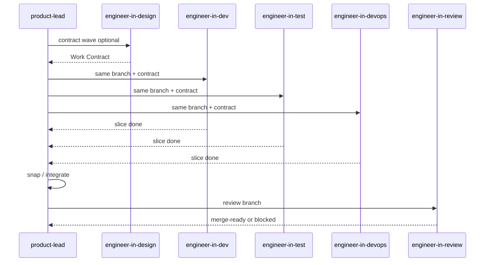

# Parallel wave (same branch)

For a single repo task, **dev**, **test**, and **devops** work **in parallel on
the same git branch**, against a shared **work contract**. When all three
finish their slices, root + product-lead **snap** the pieces and hand off to
**review** (then one PR).



## Phases

| Phase | Who | Output |
| --- | --- | --- |
| 0 Contract | `product-lead` (+ `engineer-in-design` if needed) | Work Contract in plan or issue |
| 1 Parallel wave | `dev` + `test` + `devops` same `branch` | Role slices committed on that branch |
| 2 Snap | root / `product-lead` | Green suite, one coherent branch, checklist update |
| 3 Review | `engineer-in-review` | Merge recommendation |
| 4 Deliver | root (user-approved) | One PR per repo |

## Work Contract (required before parallel wave)

Product-lead publishes a short contract (in `PLAN.md` or hub issue comment):

```markdown
## Work Contract — <repo> / <branch>

**Branch:** `feat/<slug>` (all of dev/test/devops use this)
**Goal:** …

### Interfaces / seams
- …

### File ownership (avoid collisions)
| Role | Owns (paths / globs) | Must not touch |
| --- | --- | --- |
| dev | `src/…` | `**/*.test.*`, `.github/workflows/**` |
| test | `test/**`, `**/*.test.*` | production feature freelancing |
| devops | `.github/**`, scripts/CI | app business logic |

### Acceptance
- [ ] …
### Snap commands
- `<repo verify command>`
```

No parallel wave without **branch name** + **file ownership** + **acceptance**.

## Parallel rules (dev / test / devops)

- Same `checkout` + same `branch`; create branch once (first agent or root).
- Commit only inside your ownership globs; if you must cross, stop and ask root.
- Prefer small commits; pull/rebase with care — **no force-push** unless user asks.
- Do **not** open the delivery PR mid-wave; wave ends at snap.
- Return to root: files touched, commands run, blockers (contract gaps).

## Snap

When all three report done (or waived):

1. Ensure one branch tip contains all slices
2. Run contract **Snap commands**
3. Fix only integration breaks (assign a short follow-up role if needed)
4. Then spawn `engineer-in-review` on that branch
5. Open **one** PR for the repo when user allows

## Multi-repo

Parallel waves are **per repo**. Different repos may wave in parallel with each
other. Cross-repo contracts stay in the hub plan.
